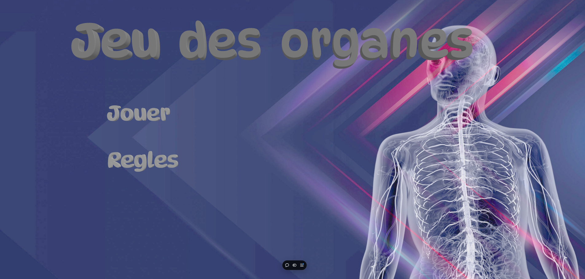
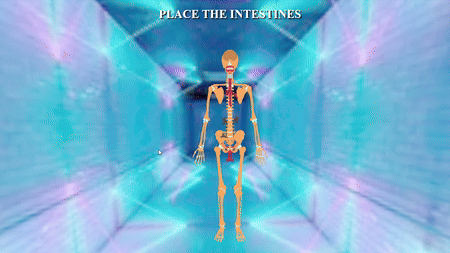

# **Projet** : **Jeu des organes**

Ce projet est un jeu ludique permettant d'identifier la position des organes dans le corps humain. Ce jeu a pour but d'améliorer la connaissance du corps humain et de ses organes.

## Mode d'emploi

Les règles du jeu sont détaillées dans la partie "règles" du menu principal.

- Il faut cliquer sur la bonne position de l'organe sur le squelette affiché à l'écran. Le jeu est fini lorsque tous les organes ont été placés correctement. Le but est de réalisé le meilleur temps possible.
- Vous avez 2 modes de jeu : un mode facile et un mode difficile.
  - Le mode facile groupe les parties d'un organe (Poumon entier et non les poumons droit et gauche séparément par exemple).
  - Le mode difficile sépare les parties d'un organe (Poumon droit, poumon gauche, partie antérieure du foi...).

## Illustrations

#### Menu principal : 

#### Choix de difficulté : 

#### Animation du Jeu : 

## Lien vers le jeu

[Accéder au jeu](https://skeleton-game.vercel.app/)

## Membres du groupe
- ARIBAUT-GAUDIN Adrien
- VAN DER PERRE Thomas

## Répartition des tâches
- Adrien : Simplification du squelette, Création du menu principal, Gestion des clicks.
- Thomas : Gestion du game design, Création du système de jeu, Création du menu de difficultés.

## Source d'inspiration
- Z-anatomy : [Modèle de squelette](https://www.z-anatomy.com/)

Le reste du jeu a été réalisé par nos soins, sans inspiration particulière.
